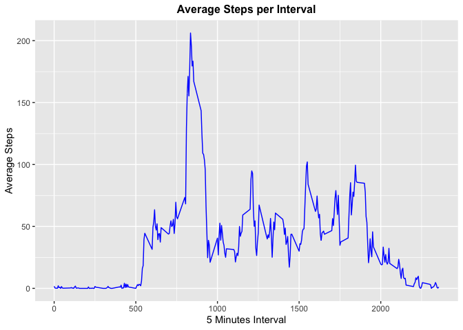

This assignment is submitted by Sai Thu Ya Aung for Reproducible Research course: course project 1.

# Introduction

It is now possible to collect a large amount of data about personal movement using activity monitoring devices such as a Fitbit, Nike Fuelband, or Jawbone Up. These type of devices are part of the “quantified self” movement – a group of enthusiasts who take measurements about themselves regularly to improve their health, to find patterns in their behavior, or because they are tech geeks. But these data remain under-utilized both because the raw data are hard to obtain and there is a lack of statistical methods and software for processing and interpreting the data.

This assignment makes use of data from a personal activity monitoring device. This device collects data at 5 minute intervals through out the day. The data consists of two months of data from an anonymous individual collected during the months of October and November, 2012 and include the number of steps taken in 5 minute intervals each day.

The data for this assignment can be downloaded from the course web site:

Dataset: [Activity monitoring data](https://d396qusza40orc.cloudfront.net/repdata%2Fdata%2Factivity.zip) [52K]
The variables included in this dataset are:

steps: Number of steps taking in a 5-minute interval (missing values are coded as 
NA
NA)
date: The date on which the measurement was taken in YYYY-MM-DD format
interval: Identifier for the 5-minute interval in which measurement was taken
The dataset is stored in a comma-separated-value (CSV) file and there are a total of 17,568 observations in this dataset.
\

## Loading and preprocessing the data


```r
if(!file.exists("./dataset")){dir.create("./dataset")}
downloadUrl <- "https://d396qusza40orc.cloudfront.net/repdata%2Fdata%2Factivity.zip"
download.file(downloadUrl, destfile = "./dataset/download.zip") 

unzip(zipfile = "./dataset/download.zip", exdir = "./dataset")

movement_data <- read.table("./dataset/activity.csv", sep = ",", header = TRUE, na.strings = "NA")
movement_data$date <- as.Date(movement_data$date, format = "%Y-%m-%d")
```

Checking the data.

```r
head(movement_data)
```

```
##   steps       date interval
## 1    NA 2012-10-01        0
## 2    NA 2012-10-01        5
## 3    NA 2012-10-01       10
## 4    NA 2012-10-01       15
## 5    NA 2012-10-01       20
## 6    NA 2012-10-01       25
```

```r
str(movement_data)
```

```
## 'data.frame':	17568 obs. of  3 variables:
##  $ steps   : int  NA NA NA NA NA NA NA NA NA NA ...
##  $ date    : Date, format: "2012-10-01" "2012-10-01" ...
##  $ interval: int  0 5 10 15 20 25 30 35 40 45 ...
```

Loading required packages.

```r
library(ggplot2)
library(dplyr)
```
\

## What is mean total number of steps taken per day?

Creating dataset without NA values.

```r
total_steps_per_date <- aggregate(steps ~ date,
                                  data = movement_data,
                                  na.rm = TRUE,
                                  FUN = sum)
```

Plotting histogram using ggplot.

```r
ggplot(total_steps_per_date, aes(steps)) +
        geom_histogram(binwidth = 1000, fill = "skyblue", col = "black") +
        ggtitle("Total Number of Steps taken per Day") +
        theme(plot.title = element_text(hjust = 0.5, face = "bold", size = 12)) +
        xlab("Total Steps per Day") +
        ylab("Frequency") + 
        scale_x_continuous(breaks = seq(0, 25000, 2500))
```

<!-- -->

Mean and median for each date.

```r
data.frame(movement_data %>% group_by(date) %>% summarise(Mean=mean(steps), Median=median(steps)))
```

```
##          date       Mean Median
## 1  2012-10-01         NA     NA
## 2  2012-10-02  0.4375000      0
## 3  2012-10-03 39.4166667      0
## 4  2012-10-04 42.0694444      0
## 5  2012-10-05 46.1597222      0
## 6  2012-10-06 53.5416667      0
## 7  2012-10-07 38.2465278      0
## 8  2012-10-08         NA     NA
## 9  2012-10-09 44.4826389      0
## 10 2012-10-10 34.3750000      0
## 11 2012-10-11 35.7777778      0
## 12 2012-10-12 60.3541667      0
## 13 2012-10-13 43.1458333      0
## 14 2012-10-14 52.4236111      0
## 15 2012-10-15 35.2048611      0
## 16 2012-10-16 52.3750000      0
## 17 2012-10-17 46.7083333      0
## 18 2012-10-18 34.9166667      0
## 19 2012-10-19 41.0729167      0
## 20 2012-10-20 36.0937500      0
## 21 2012-10-21 30.6284722      0
## 22 2012-10-22 46.7361111      0
## 23 2012-10-23 30.9652778      0
## 24 2012-10-24 29.0104167      0
## 25 2012-10-25  8.6527778      0
## 26 2012-10-26 23.5347222      0
## 27 2012-10-27 35.1354167      0
## 28 2012-10-28 39.7847222      0
## 29 2012-10-29 17.4236111      0
## 30 2012-10-30 34.0937500      0
## 31 2012-10-31 53.5208333      0
## 32 2012-11-01         NA     NA
## 33 2012-11-02 36.8055556      0
## 34 2012-11-03 36.7048611      0
## 35 2012-11-04         NA     NA
## 36 2012-11-05 36.2465278      0
## 37 2012-11-06 28.9375000      0
## 38 2012-11-07 44.7326389      0
## 39 2012-11-08 11.1770833      0
## 40 2012-11-09         NA     NA
## 41 2012-11-10         NA     NA
## 42 2012-11-11 43.7777778      0
## 43 2012-11-12 37.3784722      0
## 44 2012-11-13 25.4722222      0
## 45 2012-11-14         NA     NA
## 46 2012-11-15  0.1423611      0
## 47 2012-11-16 18.8923611      0
## 48 2012-11-17 49.7881944      0
## 49 2012-11-18 52.4652778      0
## 50 2012-11-19 30.6979167      0
## 51 2012-11-20 15.5277778      0
## 52 2012-11-21 44.3993056      0
## 53 2012-11-22 70.9270833      0
## 54 2012-11-23 73.5902778      0
## 55 2012-11-24 50.2708333      0
## 56 2012-11-25 41.0902778      0
## 57 2012-11-26 38.7569444      0
## 58 2012-11-27 47.3819444      0
## 59 2012-11-28 35.3576389      0
## 60 2012-11-29 24.4687500      0
## 61 2012-11-30         NA     NA
```

Mean and median of total steps

Mean of total steps.

```r
mean(total_steps_per_date$steps, na.rm = TRUE)
```

```
## [1] 10766.19
```

Median of total steps.

```r
median(total_steps_per_date$steps, na.rm = TRUE)
```

```
## [1] 10765
```
\

## What is the average daily activity pattern?

Creating a data set for average daily activity without NA values.

```r
average_steps_per_interval <- aggregate(steps ~ interval,
                                        data = movement_data,
                                        na.rm = TRUE,
                                        FUN = mean)
```

Plotting line graph using ggplot.

```r
ggplot(average_steps_per_interval, aes(x = interval, y = steps)) +
        geom_line(col = "blue") + 
        ggtitle("Average Steps per Interval") +
        theme(plot.title = element_text(hjust = 0.5, face = "bold", size = 12)) +
        xlab("5 Minutes Interval") +
        ylab("Average Steps")
```

<!-- -->

Interval with maximum steps.

```r
average_steps_per_interval[which.max(average_steps_per_interval$steps),]
```

```
##     interval    steps
## 104      835 206.1698
```
\

## Imputing missing values

Total number of NA values.

```r
dim(movement_data[movement_data$steps == "NA",])
```

```
## [1] 2304    3
```

Following code shows that there are some dates with only NA values.

```r
aggregate(steps ~ date,
          data = movement_data,
          na.action = na.pass,
          FUN = sum)
```

```
##          date steps
## 1  2012-10-01    NA
## 2  2012-10-02   126
## 3  2012-10-03 11352
## 4  2012-10-04 12116
## 5  2012-10-05 13294
## 6  2012-10-06 15420
## 7  2012-10-07 11015
## 8  2012-10-08    NA
## 9  2012-10-09 12811
## 10 2012-10-10  9900
## 11 2012-10-11 10304
## 12 2012-10-12 17382
## 13 2012-10-13 12426
## 14 2012-10-14 15098
## 15 2012-10-15 10139
## 16 2012-10-16 15084
## 17 2012-10-17 13452
## 18 2012-10-18 10056
## 19 2012-10-19 11829
## 20 2012-10-20 10395
## 21 2012-10-21  8821
## 22 2012-10-22 13460
## 23 2012-10-23  8918
## 24 2012-10-24  8355
## 25 2012-10-25  2492
## 26 2012-10-26  6778
## 27 2012-10-27 10119
## 28 2012-10-28 11458
## 29 2012-10-29  5018
## 30 2012-10-30  9819
## 31 2012-10-31 15414
## 32 2012-11-01    NA
## 33 2012-11-02 10600
## 34 2012-11-03 10571
## 35 2012-11-04    NA
## 36 2012-11-05 10439
## 37 2012-11-06  8334
## 38 2012-11-07 12883
## 39 2012-11-08  3219
## 40 2012-11-09    NA
## 41 2012-11-10    NA
## 42 2012-11-11 12608
## 43 2012-11-12 10765
## 44 2012-11-13  7336
## 45 2012-11-14    NA
## 46 2012-11-15    41
## 47 2012-11-16  5441
## 48 2012-11-17 14339
## 49 2012-11-18 15110
## 50 2012-11-19  8841
## 51 2012-11-20  4472
## 52 2012-11-21 12787
## 53 2012-11-22 20427
## 54 2012-11-23 21194
## 55 2012-11-24 14478
## 56 2012-11-25 11834
## 57 2012-11-26 11162
## 58 2012-11-27 13646
## 59 2012-11-28 10183
## 60 2012-11-29  7047
## 61 2012-11-30    NA
```
So imputing NA values with the mean of interval is better than with mean/median of that day.


Creating a data set for the total number of steps taken each day with NA values imputed.

```r
movement_data$average_interval <- ifelse(is.na(movement_data$steps),
                                         yes = average_steps_per_interval$steps[match(movement_data$interval, average_steps_per_interval$interval)],
                                         no = movement_data$steps)

average_steps_per_date_NAimputed <- aggregate(average_interval ~ date,
                                              data = movement_data,
                                              FUN = sum)
```

Plotting histogram using ggplot.

```r
ggplot(average_steps_per_date_NAimputed, aes(average_interval)) +
        geom_histogram(binwidth = 1000, fill = "skyblue", col = "black") +
        ggtitle("Total number of steps taken per day (NAs imputed with average steps per day)") +
        theme(plot.title = element_text(hjust = 0.5, face = "bold", size = 12)) +
        xlab("Total Steps per Day") +
        ylab("Frequency") + 
        scale_x_continuous(breaks = seq(0, 25000, 2500))
```

<!-- -->
\

## Are there differences in activity patterns between weekdays and weekends?

Creating a dataset with new column indicating date weekday or weekend

```r
movement_data$day_type <- ifelse(weekdays(movement_data$date) == "Saturday" | weekdays(movement_data$date) == "Sunday",
                                 yes = "Weekend",
                                 no = "Weekday")

average_steps_per_date_type <- aggregate(average_interval ~ interval + day_type,
                                         data = movement_data,
                                         FUN = mean)
```

Plotting time series plots comparing weekday and weekend using ggplot.

```r
ggplot(average_steps_per_date_type, aes(interval, average_interval, col = day_type)) +
        geom_line() + 
        facet_grid(day_type ~ .) +
        ggtitle("Average Steps per Interval between Weekdays and Weekends") +
        theme(plot.title = element_text(hjust = 0.5, face = "bold", size = 12)) +
        xlab("5 Minutes Interval") +
        ylab("Average Steps")
```

<!-- -->
